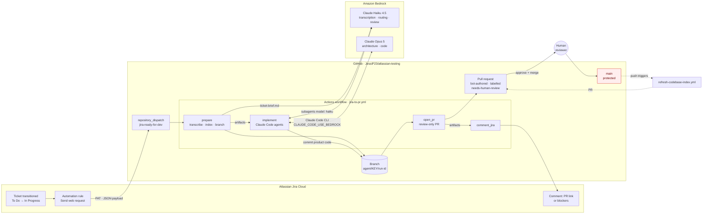
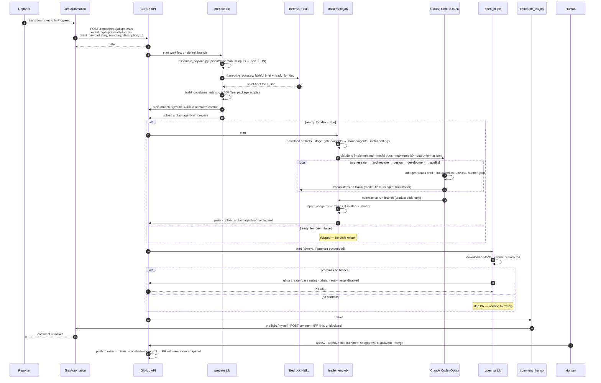
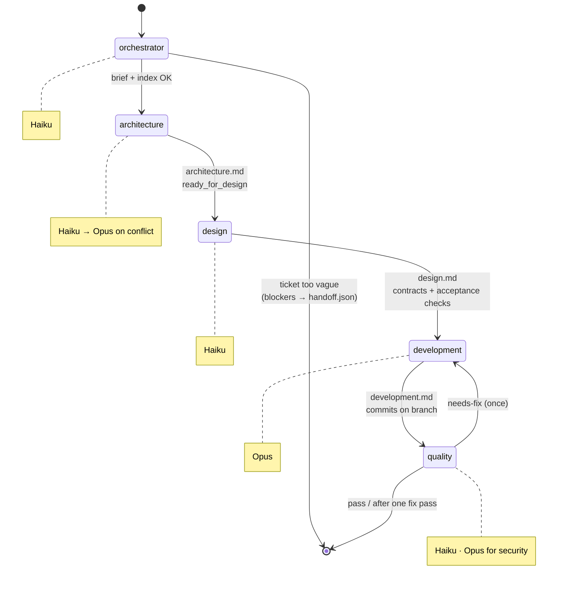

# Jira → Bedrock agents → review-only PR: architecture

A Jira status change becomes a GitHub pull request written by Claude models on Amazon Bedrock. A human reviews and merges; the pipeline never does. This document is the end-to-end map: what runs where, how the pieces hand off, what it costs, what changes for production, and how to make it work on a 70,000-file codebase.

Measured on this repo (Next.js starter, ~40 source files): **~7 minutes from Jira transition to PR, ~$2–4 of Bedrock per ticket.**

---

## 1. High-level flow



The red node is the only place the pipeline is forbidden to touch. Every other arrow is automated.

---

## 2. Step-by-step sequence



---

## 3. Components

| Layer | File | Role |
| --- | --- | --- |
| Trigger contract | Jira rule (`SETUP.md` §4c) | Fires on transition; JSON body with `.jsonEncode` smart values inside quotes |
| Workflow | `.github/workflows/jira-to-pr.yml` | Four jobs; explicit `permissions`; `concurrency` per issue key |
| Workflow | `.github/workflows/refresh-codebase-index.yml` | On push to `main`, rebuild index snapshot, open PR if changed |
| Spec | `.github/workflows/jira-to-pr.md` | gh-aw style markdown description of the same pipeline |
| Payload | `scripts/assemble_payload.py` | Normalises `repository_dispatch` vs `workflow_dispatch` into one JSON |
| Transcription | `scripts/transcribe_ticket.py` | Bedrock Haiku → `ticket-brief.md/.json`, `ready_for_dev`; deterministic fallback if the model fails |
| Schema | `ticket-schema.json` | Shape of the brief; verbatim fields must not be paraphrased |
| Context | `scripts/build_codebase_index.py` | Compact repo map: tree (≤200 files), package scripts, deps |
| Run bootstrap | `scripts/start_run.py` | Seeds `handoff.json`; writes blocked body when not ready |
| Agents | `.github/agents/*.agent.md` | Six role profiles with model, tools, hard rules, output contract |
| Agent staging | `scripts/stage_agents.sh` | Copies profiles to `.claude/agents` where Claude Code discovers them |
| Guardrails | `claude-ci-settings.json` | Allow-list of tools/commands; deny-list for merge, force-push, push to main |
| Coding prompt | `prompts/implement.md` | Top-level instructions for the Opus session |
| Cost | `scripts/report_usage.py` | Prices Claude Code's JSON usage at Bedrock rates → step summary + `usage.json` |
| PR | `scripts/open_pr.sh`, `scripts/ensure_pr_body.py` | Creates PR, labels, disables auto-merge; skips when no commits |
| Jira write-back | `scripts/comment_jira.py` | Preflight auth (site URL, then `api.atlassian.com` gateway for scoped tokens); post PR link or blockers |
| Models | `models.yml` + repo variables | `BEDROCK_HAIKU_MODEL`, `BEDROCK_OPUS_MODEL` |
| Auth | Repo secrets | AWS access keys (or OIDC role), Jira email/token/URL, optional GitHub App |

---

## 4. How the agents work internally

One Claude Code session runs on **Opus** with `--permission-mode bypassPermissions` (non-interactive) and `--max-turns 80`. The six profiles in `.github/agents/` are staged as Claude Code **custom subagents**. The orchestrator profile is the entry role; it delegates to the others in order. Each profile's frontmatter sets `model: haiku` or `model: opus`, which Claude Code maps to `ANTHROPIC_DEFAULT_HAIKU_MODEL` / `ANTHROPIC_DEFAULT_OPUS_MODEL` — i.e. the Bedrock inference profile IDs from your repo variables. That is how cheap steps land on Haiku inside an Opus session.



Handoff is a file, not a conversation: `handoff.json` (`stage`, `next_agent`, `ready_for_dev`, `blockers`, `artifacts`) plus one markdown note per stage. All of this lives in `.github/agentic/run/`, which is **gitignored**. It moves between jobs as an Actions artifact (30-day retention) and never enters the PR. Only the development agent's commits do.

Two rules do most of the safety work:

- **Fidelity over helpfulness.** The brief keeps `verbatim_summary` and `verbatim_description`; agents may add structure but not acceptance criteria. On a ticket that said only "Fix the thing", the pipeline ran `npm ci`, `lint`, and `build`, confirmed nothing was broken, wrote zero code, and reported four questions back. That is the intended failure mode.
- **Never merge, mechanically.** Denied commands in `claude-ci-settings.json`; `open_pr.sh` runs `gh pr merge --disable-auto`; PRs are authored by `github-actions[bot]` so the human *can* approve them (GitHub forbids self-approval); `main` requires a PR plus one approval, and only the admin can bypass.

---

## 5. Measured runs

| Run | Ticket | prepare | implement | open_pr | PR size | Outcome |
| --- | --- | --- | --- | --- | --- | --- |
| 33774330508 | `TEST-0` "Fix the thing" (deliberately vague) | 19s | 4m28s | 14s | 0 product files | Refused to invent scope; wrote blockers |
| 33776224757 | `KAN-1` status page + `/api/health` | 11s | ~6m | 14s | 2 product files | PR #4 |
| 33778141548 | `KAN-1` (re-triggered) | 11s | 6m57s | 14s | 2 product files | PR #6 |

GitHub Actions minutes are free on a public repo. On a private repo the same run is ~8 billable minutes (Linux, $0.008/min ≈ $0.06).

---

## 6. Costs

Bedrock list prices, global endpoint, per million tokens (September 2026): **Haiku 4.5** $1 in / $5 out · **Opus 5** $5 in / $25 out · cache reads 10% of input · cache writes 125% of input · regional endpoints +10%.

Where the money goes in a run:

| Stage | Model | Typical tokens | Cost |
| --- | --- | --- | --- |
| Transcription | Haiku | 3–6k in, 1k out | < $0.02 |
| Orchestrator / architecture / design / quality subagents | Haiku | 30–80k in total, 5k out | $0.05–0.10 |
| Development (agentic loop, 30–60 turns) | Opus | 15–30k uncached in · 1.5–3M cache reads · 100–200k cache writes · 20–40k out | $2–4 |
| **Total per small ticket** | | | **≈ $2–4** |

The Opus loop dominates and its cost is almost entirely **cache reads**: Claude Code re-sends the growing conversation on every turn. Three levers, in order of impact:

1. **Fewer turns.** Precise tickets and a small, relevant context finish in fewer iterations. The TEST-0 refusal cost less than the KAN-1 implementation because it stopped early.
2. **Smaller context per turn.** A 200-file index is ~4k tokens; a 70k-file tree would be ~1.5M and impossible. Section 8 covers this.
3. **Route more to Haiku/Sonnet.** Quality review, design contracts, and transcription are already on Haiku. Sonnet 5 ($3/$15) is a sensible middle tier for routine implementation once you trust the pipeline; keep Opus for architecture conflicts and security-sensitive changes.

Monthly, at 50 tickets: **$100–200 Bedrock + $0 Actions (public) or ~$3 (private)**. At 500 tickets: $1–2k. Set an AWS Budget alert on the Bedrock service and a per-run ceiling (`--max-turns`, and a `max_budget_usd` check on `usage.json` once you have a baseline).

`report_usage.py` now writes real numbers for every run into the job summary and `usage.json`; replace the estimates above with your own after ten runs.

---

## 7. Production readiness

What is fine for a demo and what to change before real teams depend on it.

| Area | Demo (now) | Production |
| --- | --- | --- |
| **AWS auth** | Long-lived access keys in repo secrets | GitHub OIDC → IAM role with a trust policy scoped to `repo:ORG/REPO:ref:refs/heads/main`; no stored keys. Workflow already supports `AWS_ROLE_TO_ASSUME`. |
| **GitHub auth** | `GITHUB_TOKEN` | A GitHub App (`APP_ID`/`APP_PRIVATE_KEY`). App-created PRs trigger CI; `GITHUB_TOKEN` ones do not, so today agent PRs get no checks. |
| **Jira auth** | One user's API token | A Jira service account with a scoped token (`write:jira-work`); the script already routes scoped tokens via `api.atlassian.com`. Rotate on a schedule. |
| **Inbound trust** | Any holder of the PAT can dispatch | Move the PAT into a dedicated machine user with access to one repo; or front the dispatch with an API Gateway/Lambda that verifies a Jira webhook secret before calling GitHub. Reject payloads whose `issue_url` host isn't your site. |
| **Model access** | Cross-region inference profiles, on-demand | Same, plus provisioned throughput if you exceed on-demand quotas; enable Bedrock model invocation logging to S3/CloudWatch for audit. |
| **Concurrency** | One run per issue key; runs on the same ticket queue | Keep. Add a job-level `timeout-minutes` you have measured (60 is generous), and cancel superseded runs when a ticket is re-triggered. |
| **Runners** | `ubuntu-latest`, `npm install -g` Claude Code each run | Pin the Claude Code version. For private code, self-hosted or larger runners with a warm dependency cache; a container image with Claude Code, Node, Python, and `boto3` preinstalled saves ~1 min per run. |
| **Guardrails** | Command allow/deny list; agent prompt rules | Add: a `CODEOWNERS` file so agent PRs auto-request the right reviewers; a required CI check that fails if the diff touches `.github/`, secrets patterns, or lockfiles without a matching acceptance criterion; Dependabot-style path filters. |
| **Observability** | Actions logs; `usage.json` artifact | Ship `usage.json` and `handoff.json` to a datastore per run (S3 + Athena is enough). Dashboard: cost/ticket, turns/ticket, refusal rate, human edit distance on merged PRs. |
| **Evaluation** | Manual review of PRs | Keep a set of 10–20 "golden" tickets with known-good diffs; run them on every prompt or agent-profile change; compare acceptance-criterion pass rate before rolling out. |
| **Prompt drift** | Agents edited by hand in `main` | Treat `.github/agents/` and `prompts/` as code: PR review required, changelog, eval run in CI. |
| **Blast radius** | Agent can run any `npm`/`git`/`python` command | Run the implement job in a container with no outbound network except Bedrock and GitHub; drop `Bash(git *)` to the specific subcommands used. |
| **Human loop** | Comment on Jira, label PR | Also post to a Slack/Teams channel, assign the PR to the ticket's reporter or component owner, and transition the ticket to "In Review" (a *status* change is fine; merging is not). |

---

## 8. Scaling to a 70,000-file codebase

The current index is a flat tree capped at 200 files plus `package.json` scripts. It is a hint, not a map, and on a monorepo it collapses: the agent falls back to `grep -rn` sweeps, which is exactly the failure `panda-agent-router` was built to delete. Its README puts the economics in one line: *"A ticket-to-PR agent's cost is dominated not by writing code but by finding where to write it."*

The rest of this section is grounded in that project's measurements (6,258-file monorepo, 1,796 tickets mined from merged PRs, 442 held-out tickets, time-split eval), not in intuition. Where my earlier draft disagreed with its data, the data wins.

### 8.1 Target context architecture

```mermaid
flowchart TB
    subgraph Offline["Built on merge to main · deterministic · $0 · ~2s for 6k files"]
        IDX[index.json<br/>per file: path, package, exports, imports,<br/>GraphQL ops, routes, loc]
        HIST[history.json<br/>ticket → files actually changed<br/>mined from merged PRs, 3-dot diff]
        BASE[baseline.json<br/>tests already failing on main<br/>per base commit]
    end

    subgraph Online["Per ticket · prepare job"]
        TB[ticket brief] --> ROUTE[Route · $0 · ~2s<br/>hard signals ≫ BM25 + import graph + history]
        ROUTE -->|top 50| RERANK[Re-rank · Haiku · ~$0.01<br/>listwise over all 50 → ≤5 files<br/>or confidence: low → refuse]
        RERANK --> PLAN[Plan · Haiku<br/>impactedFiles · steps · newTests]
        PLAN --> PACK[Context pack · $0<br/>targets full text (1,800-line total budget)<br/>importers · dependencies · siblings<br/>precedent tickets · existing tests]
        PACK --> AGENT[Claude Code · Opus<br/>told: 'it is already in your context, do not grep'<br/>allow-list enforced on real git diff]
    end

    IDX & HIST --> ROUTE
    IDX & HIST --> PACK
    BASE --> VERIFY[Verify: scoped tests<br/>report NEW failures only]
    AGENT --> VERIFY
```

**What the numbers say, and what each one forces**

| Measurement | Design consequence |
| --- | --- |
| any-hit@25 = 49.8%, any-hit@50 = 61.5%, @75 = 65.4% | Retrieve **50**, not 25. Retrieval is free; +11.8pp of ceiling for $0. Past ~75 the curve flattens and the prompt starts to cost. |
| Rank 1 is correct 11.5%; half the hits sit in ranks 2–50 | The ordering is weak evidence. The re-rank prompt must say "read the whole list" — listwise, not pointwise. |
| 25.1% of tickets never surface a correct file in the top 200 | That is the hard ceiling. **Refuse must be a first-class terminal state**, not an error path. |
| History signal = +15pp on any-hit@25, the only signal that improves on its own | Mine ticket→files from merged PRs on day one. Every merged agent PR then feeds it. |
| History `count` beats `lift` decisively (50.0% vs 37.1%) | Do not normalise file popularity away; a file touched by 30% of tickets sits on the path of most work. |
| Haiku re-rank 55% hit@5 vs Opus 60% at n=20 (one ticket), half the latency, ~5× cheaper | Re-rank on **Haiku**. Every bounded "read X, emit structured Y" job goes to the fast tier. |
| LLM query expansion: 9.6% term validity, zero lift | Do not spend a model call rewriting the ticket into code vocabulary. |
| Intra-file symbol/string vocabulary in BM25: −1 to −2pp | Index the *exported surface*, imports, routes, GraphQL ops. Whole-file vocabulary adds document frequency, not signal. |
| Single-file tickets = 36% of corpus, hardest case (29% → 43.5% at k=50) | Expect the demo's KAN-1-style tickets to be the *easy* case in a real queue. |
| Context pack of 8 × 500 lines = ~21k tokens before the first edit | Budget the **whole pack** (1,800 lines total) and divide by target count; never per-file. |
| `nx affected` on a shared schema change → 196 projects, 133 pre-existing failures | Scope tests to **owner projects**; consumers get build/typecheck only. Subtract the **baseline** so the verdict is "N *new* failures". |

**Principles that follow**

- **Deterministic first, model second.** Index, route, graph expansion, context pack, guard: all filesystem + git, all $0, all checkable. A model touches the pipeline exactly where it measurably pays: re-rank (3× top-5), plan, patch, repair.
- **Retrieval before reading.** The agent receives a context pack and an explicit allow-list of paths. The prompt tells it the pack *is* the context; re-deriving it with `grep` costs money and finds nothing new.
- **Refusal is cheap and useful.** A ticket that cannot be localised costs ~$0.02 and returns "not this one, and here is why" to the reporter. In the demo this already happens at the orchestrator; on a large repo it should happen at *locate*, before any Opus turn.
- **Freshness contract.** Index and pack record the `main` SHA they were built from; the agent refuses if its branch base differs. Already true for the demo index — keep it.
- **Embeddings are Phase 2, behind an eval.** They may beat BM25; they also cost a vector store, an embedding pass, and a re-embed on every merge. Build the harness first, then let it decide.

### 8.2 What to build, in order

1. **Indexer** (`par index`): exports, imports, packages, routes, GQL ops per source file. Regex extraction is fine for v1 — swap to tree-sitter only if the eval says precision is the bottleneck. Full rebuild is seconds; incremental indexing is unnecessary at 6k files and probably still at 70k. Store in S3, not git.
2. **Ground-truth miner** (`par mine`): for every merge commit carrying a ticket key, take the 3-dot diff (merge-base…branch tip, *not* the two-parent diff), drop merges touching >40 files. This is both the history signal and the eval set.
3. **Eval harness** (`par eval`): time-split, reachability-corrected, any-hit@k curve. Run it before *and after* every retrieval change. Without this step, everything after it is guesswork.
4. **Router** (`par route --k 50 --json`): hard signals (pasted paths, symbols, routes, stack traces) dominate; then BM25 over the indexed surface, one import-graph hop, history. Tune weights with `diag.mjs`.
5. **Locate + re-rank on Haiku**, with `confidence: low` routing to refuse.
6. **Plan on Haiku** → `impactedFiles`, `steps`, `newTests`. This is the allow-list.
7. **Context pack + guard.** Pack: targets (bounded), importers, dependencies, siblings, precedent, tests. Guard: DENY list checked on the real diff (credentials, lockfiles, `.github/workflows/`, the agent's own config), ALLOW = plan, `DIFF_LIMITS` (12 files / 400 lines), and an escalation protocol so the agent can *name* a needed file and get one re-plan instead of working around it.
8. **Baseline + scoped verify.** Snapshot failing tests per base commit once; verify runs owner-project tests and reports only new failures; repair loop bounded at 3.
9. **Close the loop.** Every merged agent PR is mined back into `history.json`.

Sparse checkout (only allow-listed paths plus build config) and test-level selection are the next 10% after the above.

### 8.3 Where the demo stands against that list

| Capability | Demo today | Gap |
| --- | --- | --- |
| Index | flat tree ≤200 files + scripts | no exports/imports/packages, no graph |
| Ground truth / eval | none | cannot measure any change |
| Route | none — agent explores | the largest cost driver on a big repo |
| Re-rank / plan | implicit inside one Opus session | not bounded, not on the fast tier by construction |
| Context pack | index + brief, agent reads the rest | no importers/precedent/tests, no token budget |
| Guard on diff | prompt rules + denied commands | nothing checks the *actual* diff against a plan |
| Baseline / scoped verify | agent runs `lint`/`build` itself | on a monorepo this becomes "run everything" |
| Refuse | orchestrator stops; blockers → Jira | happens after Opus starts, not before |
| Budget | `--max-turns 80`, usage report | no USD cap, no reserve for the final step |
| Loop closure | index refresh on merge | merged PRs don't feed a history model |

---

## 9. Comparison with `panda-agent-router`

Two projects, same goal, complementary strengths. Paths below are relative to `/Users/jessipavia/agent-asset-panda/panda-agent-router`.

### 9.1 What it is

Two layers in one repo (71 tracked files, Node ≥20, ESM, effectively zero dependencies beyond the Bedrock SDK and LangGraph):

- **`src/` — the router** (`par` CLI). Deterministic indexer (`indexer.mjs`), four-signal ranker (`router.mjs`), ground-truth miner (`mine.mjs`), time-split eval (`eval.mjs`), weight-sweep diagnostics (`diag.mjs`), model bench (`bench.mjs`), Jira text fetcher (`jira.mjs`). No LLM calls in the critical path.
- **`graph/` — the workflow** (`pag` CLI). A LangGraph state machine with Postgres checkpointing: `intake → locate → planning → patch → verify → (repair ≤3) → approve → publish`, with `refuse` reachable from every node. `nodes/patch.mjs` shells out to `claude -p` with `--max-budget-usd`, `--output-format stream-json`, `--dangerously-skip-permissions`, and `--disallowedTools` for every mutating git command. Supporting libs: `contextpack.mjs`, `guard.mjs`, `scope.mjs`, `baseline.mjs`, `budget.mjs`, `models.mjs`, `trace.mjs`.

It targets a 6,258-file Nx monorepo ("pioneer"). It does read Jira (ticket text via API) and does write PRs (`publish.mjs`) — but it is triggered from a laptop (`bin/run.mjs`) or a local worker, not from a Jira automation rule, and the intended deployment is AWS-native (API Gateway → SQS → Step Functions → Fargate), not GitHub Actions.

### 9.2 Side by side

| Dimension | This pipeline (`atlassian-testing`) | `panda-agent-router` | Verdict |
| --- | --- | --- | --- |
| **Trigger & transport** | Jira automation → `repository_dispatch` → Actions. Zero infra, free on public repos, already live end to end. | `bin/run.mjs` / `bin/worker.mjs` locally; Step Functions design on paper. Jira is read, not a trigger. | **Demo wins.** The GitHub-native path is real, cheap, and auditable. Keep it as the transport even for the big repo. |
| **Orchestration** | One Claude Code session; six subagents via `.claude/agents`; handoff by files. Not durable; a timeout loses everything. | LangGraph nodes = phase boundaries; each node a fresh subprocess; Postgres checkpointer; per-node trace and cost. | **Router wins** for anything you need to resume, time, or bill per phase. "LangGraph owns phase boundaries, Claude Code owns the inner loop" is the right split. In Actions, the analogue is *one job per phase* with artifacts between them — which the demo already half-does. |
| **Localisation** | None. The agent reads a 200-file list and explores. | Index + BM25 + import graph + history → 50 → Haiku re-rank → 5. Measured 55–60% hit@5 vs 20% deterministic. | **Router wins decisively.** This is the single component to port. |
| **Context for the coder** | Brief + index; agent discovers the rest. | `contextpack.mjs`: targets (bounded), importers, dependencies, siblings, precedent, tests. ~1,800 lines total, "do not grep" instruction. | **Router wins.** Precedent (past tickets that touched these files) is the part you cannot get any other way. |
| **Model routing** | `model:` in agent frontmatter — honoured by Claude Code, but soft. | `models.mjs` `NODE_TIER` table — one place, mechanical. Grounded in a bench. | **Router wins.** Motivated by a real failure where a "low tier" flag still ran Opus on summarisation. |
| **Scope control** | Prompt: "smallest diff", quality review. | Plan names `impactedFiles`; `guard.classify()` on the *real* `git diff`; `DIFF_LIMITS`; escalation file `NEED: path` → one re-plan. | **Router wins.** A 52-file diff for a one-ternary bug is what happens without it. |
| **Secrets in commits** | `.claude` unstaged; run dir gitignored; `.env` excluded from index. | `guard.DENY` regex list — `.env*`, `.npmrc`, keys, lockfiles, `.github/workflows/`, agent's own source — checked before any commit. | **Router wins.** Born from a real near-miss (`.env` with five live credentials in the commit set). Port the list verbatim. |
| **Verification** | Agent runs `lint`/`build`; quality agent reviews. | `baseline.mjs` snapshots failures on main; `scope.mjs` runs owner projects for test, type-only fan-out for build; verdict = *new* failures; `repair` ≤3. | **Router wins** on any repo with a flaky or large suite. |
| **Never merge** | Denied commands, `--disable-auto`, bot author, protected `main`. | Agent denied all git; workflow stages explicit paths; draft PR; token has no merge permission. | **Tie.** Both enforce at the tool/token layer, not the prompt. Router's *explicit-path `git add`* is the stronger habit. |
| **Budget** | `--max-turns 80`; usage report after the fact. | `Budget` class: $30 cap, $4 finalize reserve, `availableFor(node)`, `--max-budget-usd` passed to Claude. | **Router wins.** The reserve idea ("a starved finalize means no PR") is worth copying alone. |
| **Refusal** | Orchestrator stops; blockers to Jira (since today). | `refuse` node reachable from every phase; posts diagnosis, files narrowed to, and spend. | **Router wins**, but the demo now has the same shape. |
| **Evaluation** | None. | 1,796-ticket ground truth, time-split eval, recall curves, model bench, *negative results recorded in code headers* so they aren't retried. | **Router wins**, and this is the cultural difference: every design decision in that repo cites a number. |
| **Observability** | Actions logs, `usage.json`. | `runs/<KEY>/<runId>/timeline.md`, per-node state deltas, `stream.log`, optional LangSmith. | **Router wins.** Per-node cost attribution is what lets you tune the tier table. |
| **Deployment maturity** | Live. Real tickets → real PRs today. | Local runs only; README status table still says re-rank/coder/verify/finalize "not built" although `graph/src/nodes/` has all eight. | **Demo wins.** Router's docs lag its code. |
| **Language coverage** | Whatever Claude Code handles. | Indexer: `.ts .tsx .js .jsx .mjs .cjs` only; Nx/lerna package discovery. | Router needs extending for polyglot repos. |

### 9.3 What to port, in what order

The demo's transport and the router's brain. Concretely, into this repo:

1. **`guard.mjs` DENY list + diff classification** into `open_pr` as a hard gate. Cheapest, highest-value, zero model cost. Fail the job if the diff touches a denied path or exceeds `DIFF_LIMITS`.
2. **`models.mjs`-style tier table** replacing per-agent `model:` fields as the source of truth; emit it into the Claude Code settings so the mapping is mechanical.
3. **`budget.mjs` + `--max-budget-usd`** on the `claude -p` call, with a finalize reserve. `report_usage.py` already gives you the ledger.
4. **Indexer + router + miner + eval** as a new `refresh-codebase-index.yml` output: `index.json` and `history.json` to S3 (or an Actions cache keyed by `main` SHA), rebuilt on push to `main`. Mine history from this repo's own merged PRs — it will be small at first and grow with every merge.
5. **`locate` job** between `prepare` and `implement`: `par route --k 50 --json` → Haiku re-rank via Bedrock Converse → `confidence: low` → refuse to Jira before Opus starts.
6. **`plan` job on Haiku** → `impactedFiles` → **context pack** → passed to `implement` as an artifact; prompt updated to "it is already in your context, do not grep".
7. **`baseline.mjs` + `scope.mjs`** in a `verify` job. On the Next.js demo this is overkill; on the 70k-file target it is the difference between a 7-minute gate and a 90-minute one.
8. **Per-node `timeline.md`** as a step summary. You have most of this already in job durations; add cost per job.

Not worth porting: the LangGraph runtime itself. In GitHub Actions the job graph *is* the state machine, artifacts are the checkpoints, and re-run-failed-jobs is the resume. Adding Postgres for checkpointing buys nothing there. If you leave Actions for Step Functions later, `graph.mjs` is the reference design.

### 9.4 Hygiene findings in the router repo

- `.par/index.json` (5.5 MB, absolute path and full file inventory of a private monorepo) and `.par/history.json` (1,796 Jira tickets' text) are **tracked in git** despite `.par/` in `.gitignore` — they were added before the rule. `git rm --cached .par/*.json` and let them regenerate.
- `.env`, `.env.bak`, `graph/.env`, `graph/.env.bak-0045` exist on disk. They are correctly ignored and not tracked; the `.bak` copies are still a reason to run `gitleaks` before any push.
- README status table ("not built") is stale relative to `graph/src/nodes/`. Update it or readers will underestimate the project.
- Two conflicting `SKIP_DIRS`/noise regex lists (`indexer.mjs`, `contextpack.mjs`) and two `isUrlRoute` implementations (`indexer.mjs` inline, `router.mjs` exported). Consolidate before porting.

---

## 10. Known gaps in the demo

- **Transcription is lenient.** Haiku marked "Fix the thing" as `ready_for_dev: true`; the architecture agent caught it. Tighten `transcribe_ticket.py`'s readiness rubric (require a subject and at least one verifiable outcome) so bad tickets stop before spending an Opus session.
- **No CI on agent PRs** until a GitHub App is configured.
- **Index is a flat list** — see section 8.
- **One fix pass only.** Quality can send work back once; after that leftovers go into the PR body. Reasonable for cost, but make the threshold visible in the PR labels (`needs-fix-leftover`).
- **No retry on Bedrock throttling.** `boto3` default retries cover transcription; the Claude Code session has none beyond its own. Add `--max-turns` headroom and a job-level retry for `ThrottlingException`.
- **Jira "Done" as trigger** inverts the ticket lifecycle; use "In Progress" and let the human move it to Done after merge.
